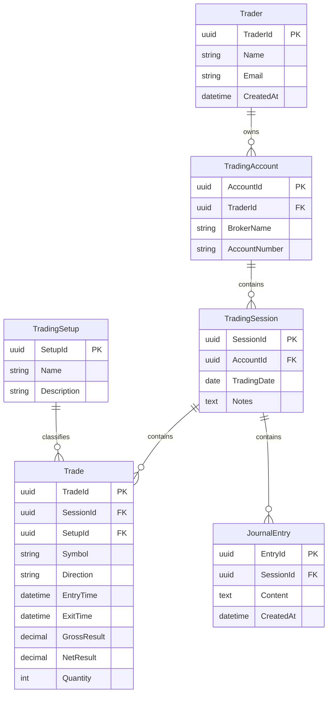

# Conceptual Domain

Trader
│
└── TradingAccount
│
└── TradingSession
│
├── Trade
│ │
│ └── TradingSetup
│
└── JournalEntry

# ERD Diagram

## Cardinality Rules

- One Trader can have many Trading Accounts.
- One Trading Account can have many Trading Sessions.
- One Trading Session can contain many Trades.
- One Trading Session can contain many Journal Entries.
- One Trading Setup can be associated with many Trades.
- A Trade may optionally reference a Trading Setup.

## Physical Model (Initial Version)

### Tables

- traders
- trading_accounts
- trading_sessions
- trades
- trading_setups
- journal_entries

### Primary Keys

All tables use UUID as primary key.

### Foreign Keys

trading_accounts.trader_id
→ traders.trader_id

trading_sessions.account_id
→ trading_accounts.account_id

trades.session_id
→ trading_sessions.session_id

trades.setup_id
→ trading_setups.setup_id

journal_entries.session_id
→ trading_sessions.session_id

## Future Enhancements

The following fields are being considered for future versions of the platform:

### Trade

- RiskAmount
- SetupConfidence

These attributes will support advanced analytics related to risk management, trader behavior, setup quality, and performance consistency.
